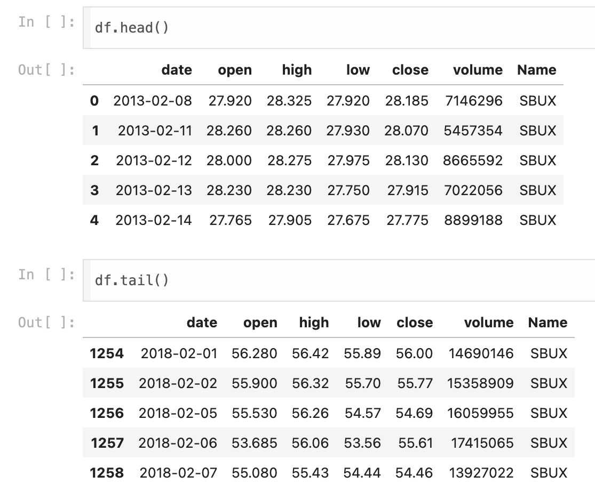
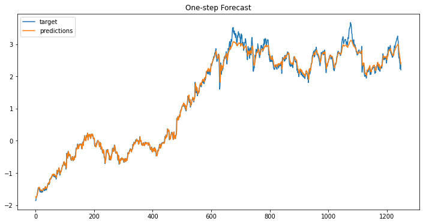
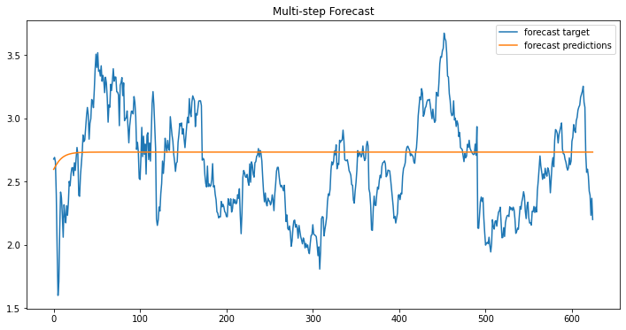

# stock_returns_prediction

The dataset used comes from [starbuck_stocks](https://raw.githubusercontent.com/lazyprogrammer/machine_learning_examples/master/tf2.0/sbux.csv)

    

"Open" is the first stock price of a particular day, while "close" is the last stock price of that day. "High" refers to the highest stock price on a specific day, and "low" refers to the lowest stock price on that day. "Volume" represents the number of shares traded on that day. Notes: Stock prices are timestamped, meaning we can observe the price of a stock at any given second on a specific day. The most important aspect of the data is whether all features fall within the same range. In this dataset, stock prices range in the tens, while the volume ranges in the millions.

## Directly Predict Stock Prediction (Predicting Stock Prices)

When we directly predict stocks, we use the 'close' column as the value. The feature used on stock predictions are the first 10 timestamps data, while the target is the next data (eleventh data). However <b> this is a wrong approach on stock prediction </b>.

The model used on stock prediction is LSTM with 5 hidden units, but it does not predict the subsequent values effectively using the existing training data. This is because the time series data in this case is highly correlated, meaning previous data is closely related to the following data. The analogy is similar to image pixels, where if one pixel is red, the adjacent pixel is likely to be red as well. Therefore, the time series prediction below results in the model merely copying the previous value (on multistep).

One-step prediction predicts a single future value, while multi-step prediction generates a sequence of future values, often requiring the model to handle more complex dependencies between data points.

    

    

## Predicting Stock Returns

Usually, when performing stock price prediction, we do not predict the stock price at the next timestamp. Instead, we predict the stock return or the daily profit generated by the stock for forecasting.

Stock returns :

$$ R = \frac{V_{\text{final}} - V_{\text{initial}}}{V_{\text{initial}}} $$

